# Day1

**前置知识**

OpenGL一般被认为是一个图形API，然而，OpenGL本身并不是一个API，它仅仅是一个由[Khronos组织](http://www.khronos.org/)制定并维护的规范。实际的OpenGL库的开发者通常是显卡的生产商，这也意味着任何时候OpenGL库表现的行为与规范规定的不一致时，基本都是库的开发者留下的bug。


**核心模式和立即渲染模式**

早期的OpenGL使用立即渲染模式，即固定渲染管线。它确实容易使用和理解，但是效率太低！

OpenGL3.2开始，规范文档开始废弃立即渲染模式，鼓励开发者在OpenGL核心模式下开发。

当使用OpenGL的核心模式时，OpenGL迫使我们使用现代的函数，现代函数要求使用者真正理解OpenGL和图形编程，它有一些难度，然而提供了更多的灵活性，更高的效率，更重要的是可以更深入的理解图形编程。


**状态机**

OpenGL自身是一个巨大的状态机，一系列的变量描述OpenGL此刻应当如何运行，这些状态集合称为OpenGL上下文（Context）。


**创建窗口**

渲染出内容，第一步：创建一个OpenGL上下文和一个用于显示的窗口。

这些操作在每个系统上都是不一样的，OpenGL有意将这些操作抽象(Abstract)出去。所以我们需要利用现成的一些库来完成这些最基本的平台相关代码，节省时间！

流行的有：GLUT、SDL、SFML、GLFW

对比一下：

**GLUT**: 适合学习和简单的 OpenGL 应用，功能有限，已停止更新。

**SDL**: 功能全面，适合游戏和多媒体应用开发，支持多种平台。

**SFML**: API 简洁，功能丰富，适用于 2D 图形、多媒体和游戏开发。

**GLFW**: 轻量级，专注于 OpenGL 窗口和输入管理，适合 OpenGL 应用。


**GLAD**

因为OpenGL只是一个标准，具体的实现是由驱动开发商实现。

由于OpenGL驱动版本众多，它大多数函数的位置都无法在编译时确定下来，需要在运行时查询。

所以任务就落在了开发者身上，开发者需要在运行时获取函数地址并将其保存在一个函数指针中供以后使用。

类似如下：

```
// 定义函数原型
typedef void (*GL_GENBUFFERS) (GLsizei, GLuint*);
// 找到正确的函数并赋值给函数指针
GL_GENBUFFERS glGenBuffers  = (GL_GENBUFFERS)wglGetProcAddress("glGenBuffers");
// 现在函数可以被正常调用了
GLuint buffer;
glGenBuffers(1, &buffer);
```

幸运的是，GLAD就是简化此过程的库，也是最流畅最新的！


**你好窗口**


**你好三角形**

先记住三个单词：

- VAO（顶点数组对象）
- VBO（顶点缓冲对象）
- IBO（索引缓冲对象） or EBO


图形渲染管线：

3D坐标转为2D坐标的处理过程是由OpenGL的图形渲染管线处理，它们可以被划分为几个阶段，每个阶段将会把前一个阶段的输出作为输入。所有这些阶段都是高度专门化，很容易并行执行！

GPU上为每一个（渲染管线）阶段运行各自的小程序，从而在快速处理你的数据。这些小程序叫做Shader！

OpenGL着色器是用OpenGL着色器语言（GLSL）编写。

渲染管线抽象如下图所示：

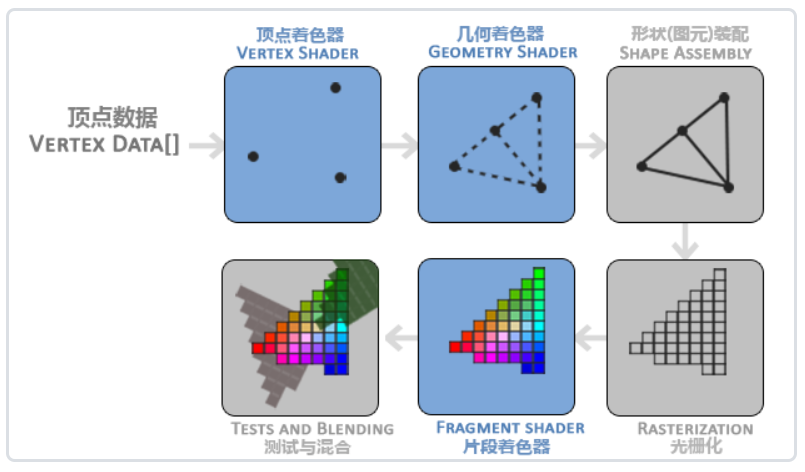


蓝色表示可自定义阶段，灰色表示固定阶段！


现代OpenGL中，我们**必须**定义至少一个顶点着色器和一个片段着色器（因为GPU中没有默认的顶点/片段着色器）。

OpenGL仅当3D坐标在3个轴（x、y和z）上-1.0到1.0的范围内时才处理。

这个范围内的坐标叫NDC坐标！此范围内的坐标最终显示在屏幕上！


**VBO**

顶点缓冲对象是我们在[OpenGL](https://learnopengl-cn.github.io/01 Getting started/01 OpenGL/)教程中第一个出现的OpenGL对象，它会在GPU内存（通常被称为显存）中储存大量顶点。使用这些缓冲对象的好处是我们可以一次性的发送一大批数据到显卡上，而不是每个顶点发送一次！


OpenGL允许我们同时绑定多个缓冲，只要它们是不同的缓冲类型！


**VAO**

绑定针对VBO的顶点数据的属性描述集合，如下图：

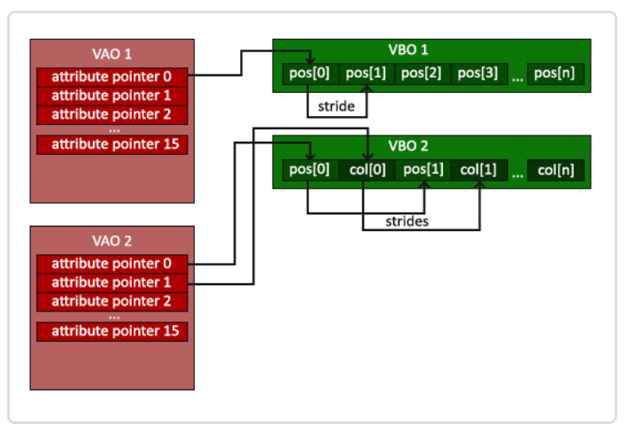


最常见的渲染之前设置状态语句：

- glUseProgram(shaderProgram); 
- glBindVertexArray(VAO); 
- glDrawArrays(GL_TRIANGLES, 0, 3);


**EBO**

可以理解为一种特殊的VBO，它只是存储构成绘制图元的顶点索引序列而已！它和VAO、VBO关系如下：

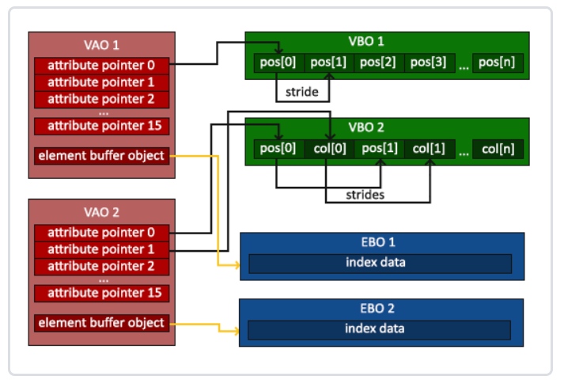


**着色器**

着色器(Shader)是运行在GPU上的小程序

典型的GLSL代码结构：

```glsl
#version version_number
in type in_variable_name;
in type in_variable_name;

out type out_variable_name;

uniform type uniform_name;

int main()
{
  // 处理输入并进行一些图形操作
  ...
  // 输出处理过的结果到输出变量
  out_variable_name = weird_stuff_we_processed;
}
```


能声明的顶点属性是有上限的，由硬件决定。OpenGL确保至少有16个包含4分量的顶点属性可用！

通过一下Code片段可查询：

```glsl
int nrAttributes;
glGetIntegerv(GL_MAX_VERTEX_ATTRIBS, &nrAttributes);
std::cout << "Maximum nr of vertex attributes supported: " << nrAttributes << std::endl;
```


**GLSL语言介绍：**

基础数据类型：

- int
- float
- double
- uint
- bool

向量类型：

- vecn（float）
- bvecn（bool）
- ivecn（int）
- uvecn（unsigned int）
- dvecn（double）


向量的分量访问：

- .x | .y | .z | .w
- .r | .g | .b | .a
- .s | .t | .p | .q

灵活的方式：重组（swizzling），如下：

- xyzz
- xxx
- xy


`layout (location = 0)`  表示：

顶点着色器为它的输入提供一个额外的`layout`标识，这样我们才能把它链接到顶点数据。


如果我们打算从一个着色器向另一个着色器发送数据：

- 发送方着色器中声明一个输出
- 接收方着色器中声明一个类似的输入
- 类型和名字都一样


**Uniform**

Uniform是另一种从我们的应用程序在 CPU 上传递数据到 GPU 上的着色器的方式。

它是全局的，它在每个着色器程序对象中独一无二，而且可以被着色器程序的任意着色器在任意阶段访问。


# Day2

**纹理**

如果想让图形看起来更真实，我们就必须有足够多的顶点，从而指定足够多的颜色。纹理就是提供颜色的工具！

纹理是一个2D图片（甚至也有1D和3D的纹理），可以把他想象成贴纸，贴到你所需要的位置！


**纹理Wrap方式**

纹理坐标的范围通常是从(0, 0)到(1, 1)，那如果我们把纹理坐标设置在范围之外会发生什么？问题的答案就是Wrap方式

OpenGL提供4个：

- GL_REPEAT (重复)
- GL_MIRRORED_REPEAT (重复镜像)
- GL_CLAMP_TO_EDGE (边缘拉伸)
- GL_CLAMP_TO_BORDER (指定超出部分颜色)

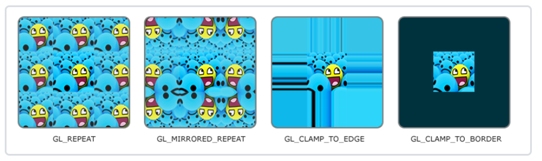


**纹理过滤**

纹理坐标不依赖于分辨率(Resolution)，它可以是任意浮点值，所以OpenGL需要知道怎样将纹理像素映射到纹理坐标！

最常见的就两种：最邻近插值、线性插值


- 最邻近插值（选择中心点最接近纹理坐标的那个像素）
- 线性插值（基于纹理坐标附近的纹理像素，计算出一个插值，近似）


如果图片分辨率过低，使用最邻近的像素效果就比较严重，使用线性插值会产生模糊效果

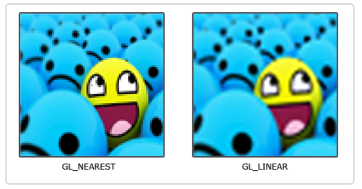


**多级渐进纹理（Mipmap）**

我们都知道，距离的远近，会导致最终显示在屏幕的像素产生非常大的不同！如果显示区域非常小，就类似产生纹理特别大的情况，这时候获取像素值就非常不真实，会产生摩尔纹！

OpenGL使用一种叫做多级渐远纹理(Mipmap)的概念来解决这个问题。简单来说就是一系列的纹理图像，后一个纹理图像是前一个的二分之一。

多级渐远纹理背后的理念很简单：距观察者的距离超过一定的阈值，OpenGL会使用不同的多级渐远纹理，即最适合物体的距离的那个！

由于距离远，解析度不高也不会被用户注意到。同时，多级渐远纹理另一加分之处是它的性能非常好。

**Mipmap类似如下：**

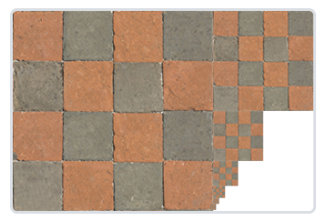


**Mipmap切换**

OpenGL在两个不同级别的多级渐远纹理层之间会产生不真实的生硬边界，切换多级渐远纹理级别时你也可以在两个不同多级渐远纹理级别之间使用NEAREST和LINEAR过滤。因此产生四种过滤方式：

- GL_NEAREST_MIPMAP_NEAREST （前面表示采样方式，后面表示Mipmap切换过滤方式。这就表示最近邻匹配mipmap，最邻近采样纹理）
- GL_LINEAR_MIPMAP_NEAREST
- GL_NEAREST_MIPMAP_LINEAR
- GL_LINEAR_MIPMAP_LINEAR


**常见错误：**将放大过滤的选项设置为多级渐远纹理过滤选项之一。这样没有任何效果！


**加载和创建纹理**

使用纹理之前要做的第一件事是把它们加载到我们的内存中。所以我们需要一个加载器！这里选用stb_image库！


## 变换

齐次坐标：x、y、z、w

位置向量：w=1

方向向量：w=0


**万向节死锁的本质：**只能按照规定的三个轴顺序依次旋转！

四元数如何解决！


**GLM**

OpenGL没有自带任何的矩阵和向量，专门为OpenGL量身定做的数学库，那就是GLM！

GLM的大多数功能都可以从下面这3个头文件中找到：

```
#include <glm/glm.hpp>
#include <glm/gtc/matrix_transform.hpp>
#include <glm/gtc/type_ptr.hpp>
```


## 坐标系统

OpenGL希望在每次顶点着色器运行后，可见的所有顶点都为标准化设备坐标（NDC）。

每个顶点的**x**，**y**，**z**坐标都应该在**-1.0**到**1.0**之间，超出这个坐标范围的顶点都将不可见。


物体的顶点在最终转化为屏幕坐标之前还会被变换到多个坐标系统，优点在于，在这些特定的坐标系统中，一些操作或运算更加方便和容易！

比较重要的总共有5个不同的坐标系统：

- 局部空间
- 世界空间
- 观察空间
- 裁剪空间
- 屏幕空间


**局部空间**

最开始的坐标，一般指建模软件导出的原始坐标


**世界空间**

永恒不变的坐标系


**观察空间**

经过视图变换后的坐标


**裁剪空间**

观察空间坐标 + 投影矩阵 + 透视除法 + Clip 


**屏幕空间**

glViewPort 指定屏幕空间变换矩阵


Z-**buffer**

深度测试，就是保证前后正确的遮挡关系！


## 摄像机

本质就是构造观察矩阵View，通过交互改变这个View模拟出一种摄像机的感觉！


这里重点讨论FPS风格的摄像机！


**摄像机的参数：**

- 位置（vec3）
- 观察方向（vec3）
- right
- up


**交互操作分两部分：**

位置移动：WASD

视角移动：鼠标


视角移动这里用欧拉角表示旋转，一共有三种欧拉角：俯仰角(Pitch)、偏航角(Yaw)和滚转角(Roll)

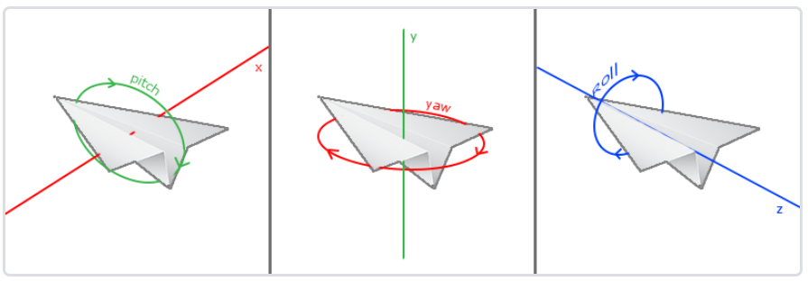


## 颜色

现实世界中有无数种颜色，我们需要用（有限的）数值来模拟（无限）的颜色，所以并不是所有现实世界中的颜色都可以用数值来表示！

颜色可以数字化的由红色(Red)、绿色(Green)和蓝色(Blue)三个分量组成，它们通常被缩写为RGB！


在现实生活中，某一物体的颜色并不是这个物体真正拥有的颜色，而是它所反射的(Reflected)颜色！

也就是说，那些不能被物体吸收的颜色就是我们能够感知到的物体颜色！


**举个例子：**如果将白光照在一个蓝色玩具上，这个玩具会吸收白光中除了蓝色以外的所有颜色，不被吸收的蓝色被反射到我们的眼中，因此看起来是蓝色！


再看个图：

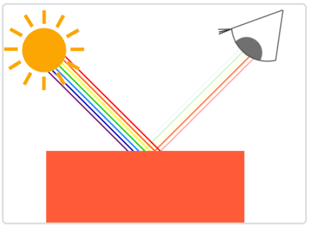


当在OpenGL中创建一个光源时，我们给光源一个颜色。当我们把光源的颜色与物体的颜色值相乘，所得到的就是这个物体所反射的颜色！


举个例子：

```glsl
glm::vec3 lightColor(1.0f, 1.0f, 1.0f);
glm::vec3 toyColor(1.0f, 0.5f, 0.31f);
glm::vec3 result = lightColor * toyColor; // = (1.0f, 0.5f, 0.31f);
```


因此，物体的颜色，本质上含义：**从光源反射各个颜色分量的系数**


# Day3


**基础光照**

现实世界的光照是极其复杂，有限的计算能力所无法模拟。

OpenGL的光照使用的是简化的模型，对现实的情况进行近似，其中一个模型被称为冯氏光照模型。

冯氏光照模型的主要结构由3个分量组成：

- 环境(Ambient)
- 漫反射(Diffuse)
- 镜面反射(Specular)

如下所示：

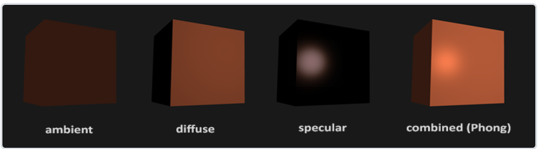


Ambient环境光：物体即使黑暗环境下最基本的颜色

Diffuse漫反射：模拟光源对物体的方向性影响，是冯氏光照模型中视觉上最显著的分量

Specular镜面反射：所谓的高光


**注意：**方向向量的w分量，例如法向量，w必须设置为0.0f，必须屏幕位移对之的影响！


**计算漫反射光照需要什么？**

- 法向量
- 定向的光线（光源的位置与片段的位置之间向量差）


**计算镜面反射需要什么？**

- 法向量
- 光照定向的光线（光源的位置与片段的位置之间向量差）
- 视线定向的光线（光源的位置与观察位置之间向量差）


Blinn Phong着色模型的计算公式：
$$
Color = k_aColor_{Ambient} + k_dColor_{Diffuse} + k_sColor_{Specular}
$$


### 材质

现实世界，每个物体会对光产生不同的反应。

钢制物体看起来通常会比陶土花瓶更闪闪发光，一个木头箱子也不会与一个钢制箱子反射同样程度的光。

有些物体反射光的时候不会有太多的散射(Scatter)，因而产生较小的高光点，而有些物体则会散射很多，产生一个有着更大半径的高光点。

通过上节，我们知道：

可以分别为三个光照分量定义一个材质颜色(Material Color)：

环境光照、漫反射光照和镜面光照，再添加一个反光度(Shininess)分量，就有了全部所需的材质属性！

```glsl
#version 330 core
struct Material {
    vec3 ambient;
    vec3 diffuse;
    vec3 specular;
    float shininess;
}; 

uniform Material material;
```


- ambient材质向量
    - 定义环境光照下表面反射什么颜色

- diffuse材质向量
    - 定义在漫反射光照下表面的颜色
- specular材质向量
    - 定义表面上镜面高光的颜色
- shininess反光度分量
    - 影响镜面高光的散射/半径


**材质属性定义了物体的实际表现！**


**以下定义光照属性**，替代原本的颜色！

```glsl
struct Light {
    vec3 position;

    vec3 ambient;
    vec3 diffuse;
    vec3 specular;
};

uniform Light light;
```


**最终的片段着色器颜色：**

```glsl
vec3 ambient  = light.ambient * material.ambient;
vec3 diffuse  = light.diffuse * (diff * material.diffuse);
vec3 specular = light.specular * (spec * material.specular);
```


### 光照贴图

上节定义了Material，让每个物体都拥有自己独特的材质从而对光照做出不同的反应，很容易在一个光照的场景中给每个物体一个独特的外观！

**但是这仍不能对一个物体的视觉输出提供足够多的灵活性，为什么呢？**

答：上一节将整个物体的材质定义为一个整体，但现实世界中的物体通常并不只包含有一种材质


所以，需要通过引入漫反射和镜面光贴图，允许更加灵活的设置物体的漫反射分量和镜面反射分量！

本质就是通过纹理，来灵活的设置每个片段的漫反射分量和镜面反射分量，从而实现更加真实的效果！


例如：漫反射贴图

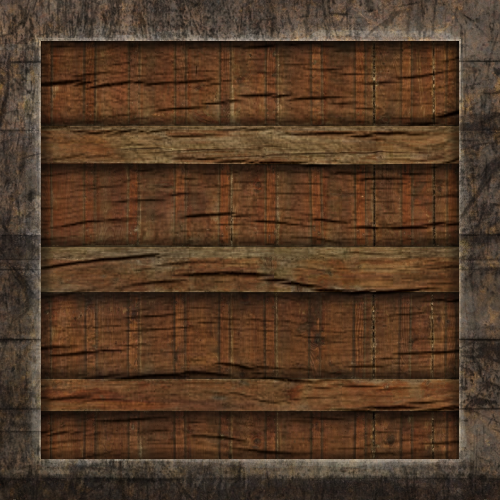


镜面反射贴图

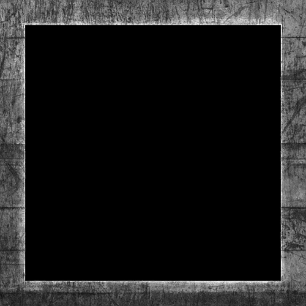


最终实现效果：

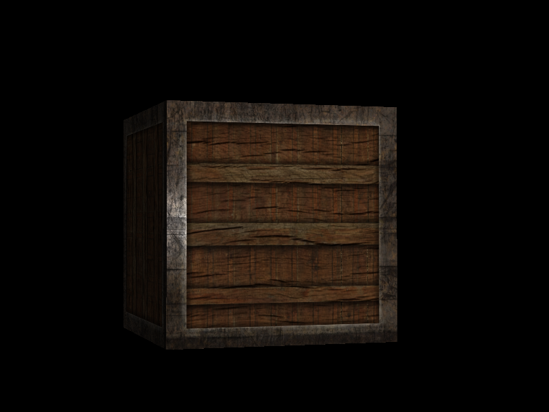


### 投光物

目前使用的光照都来自于空间中的一个点，但现实世界中，我们有很多种类的光照，每种的表现都不同。

将光**投射**(Cast)到物体的光源叫做投光物，本节讨论：

- 定向光(Directional Light)
- 点光源(Point Light)
- 聚光(Spotlight)


**平行光**

当一个光源处于很远，每条光线就会近似于互相平行，它就被称为定向光，它与光源的位置是没有关系！

定向光非常好的一个例子就是太阳，如下图所示：

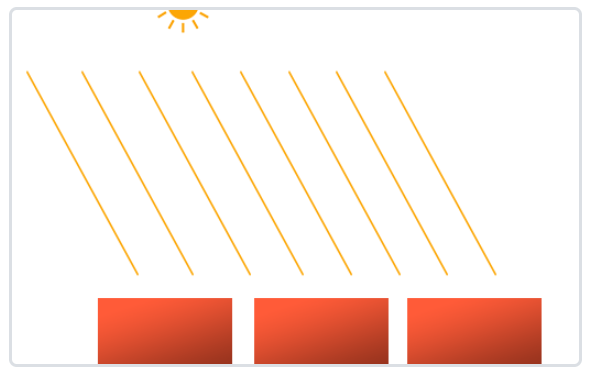


**点光源**

定向光对于照亮整个场景的全局光源是非常棒，但除了定向光之外我们也需要一些分散在场景中的点光源！

点光源是处于世界中某一个位置的光源，它会朝着所有方向发光，但光线会随着距离逐渐**衰减**。把它想象成灯泡和火把！

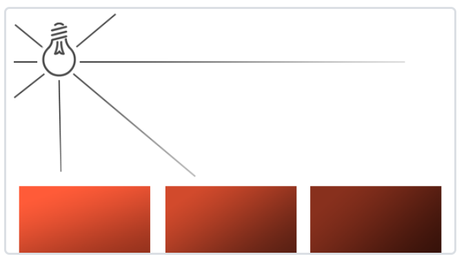


之前的光照，都是使用的简化的点光源，并没有考虑距离的衰减！


**衰减**

随着光线传播距离的增长逐渐削减光的强度通常叫做衰减。

一种方式是随距离线性衰减，这种比较假。

幸运的是已经有人给我们解决了这个问题，以下就是根据片段距离光源距离计算的衰减值！将它乘以光的强度分量！
$$
F_{att} = \frac{1.0}{K_c + K_l * d + K_q * d^2}
$$


这里解释一下几个参数：

- d代表片段距离光源距离
- $k_c$表示常数项，通常等于1.0f
- $k_l$ 表示一次项系数
- $k_q$ 表示二次项系数


以下为距离100以内的衰减曲线图：

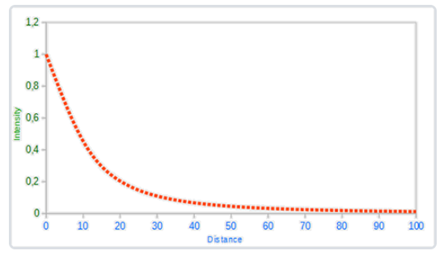


但是这三个值如何设置呢？这里给出一个常见的经验值表格：

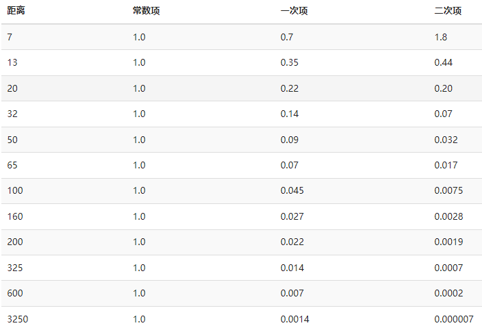


**聚光灯**

聚光是用一个世界空间位置、一个方向和一个切光角(Cutoff Angle)来表示。

只有在聚光方向的特定半径内的物体才会被照亮，其它的物体都会保持黑暗，有点像手电筒的感觉！

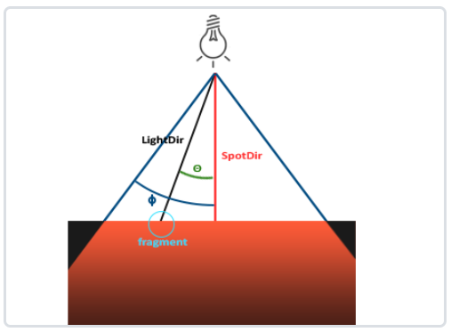


> 手电筒(Flashlight)是一个位于观察者位置的聚光，但它的位置和方向会随着玩家的位置和朝向不断更新！


**平滑边缘**

为了创建一种看起来边缘平滑的聚光，我们需要模拟聚光有一个内圆锥(Inner Cone)和一个外圆锥(Outer Cone)

内圆锥设置为上一部分中的那个圆锥；也需要一个外圆锥，来让光从内圆锥逐渐减暗，直到外圆锥的边界；

只需要再定义一个余弦值来代表聚光方向向量和外圆锥向量（等于它的半径）的夹角！


如果一个片段处于内外圆锥之间，将会给它计算出一个0.0到1.0之间的强度值。

如果片段在内圆锥之内，它的强度就是1.0，如果在外圆锥之外强度值就是0.0。


通过以下公式计算这个强度：

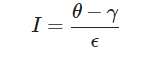

分母是：内外圆锥的余弦差。

theta是片段和灯光dir角度，gama是外圆锥角度


有一个典型值表格：

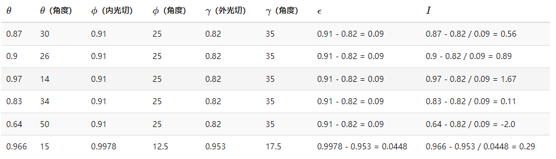


我们就根据内外余弦值之前，根据角度进行插值！


### 模型加载

模型通常都由3D艺术家在[Blender](http://www.blender.org/)、[3DS Max](http://www.autodesk.nl/products/3ds-max/overview)或者[Maya](http://www.autodesk.com/products/autodesk-maya/overview)这样的工具中精心制作。

我们的工作就是解析这些导出的模型文件以及提取所有有用的信息，将它们储存为OpenGL能够理解的格式！

模型的文件格式有很多种，每一种都会以它们自己的方式来导出模型数据：

- obj（只包含了模型数据以及材质信息）
- ada（包含模型、光照、多种材质、动画数据、摄像机、完整的场景信息）


不同种类的文件格式有很多，它们之间通常并没有一个通用的结构，如果我们想从这些文件格式中导入模型的话，我们必须要去自己对每一种需要导入的文件格式写一个导入器。很幸运的是，正好有一个库专门处理这个问题！


Assimp（**Open Asset Import Library**）

通常会将整个模型加载进一个**场景**(Scene)对象，会包含导入的模型/场景中的所有数据！

Assimp会将场景载入为一系列的节点(Node)，每个节点包含了场景对象中所储存数据的索引，每个节点都可以有任意数量的子节点！

如下图所示：

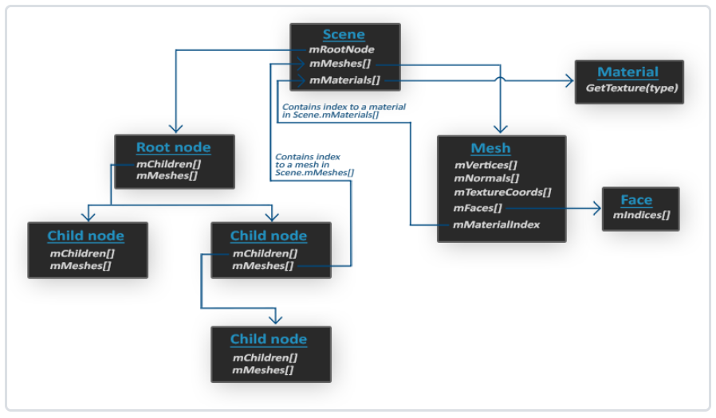


# Day4

### 高级OpenGL


**深度测试**

通过引入z-buffer实现遮挡关系。

**核心原理：**

深度测试被启用的时候，OpenGL会将一个片段的深度值与深度缓冲的内容进行对比，如果这个测试通过了的话，深度缓冲将会更新为新的深度值。如果深度测试失败了，片段将会被丢弃！


深度缓冲是在片段着色器运行之后（以及模板测试(Stencil Testing)运行之后，我们将在[下一节](https://learnopengl-cn.github.io/04 Advanced OpenGL/02 Stencil testing/)中讨论）在屏幕空间中运行！

并且可以直接使用GLSL内建变量gl_FragCoord从片段着色器中直接访问！

gl_FragCoord的x和y分量代表了片段的屏幕空间坐标（其中(0, 0)位于左下角）。gl_FragCoord中也包含了一个z分量，它包含了片段真正的深度值


**提前深度测试**

现代GPU都提供一个叫做提前深度测试(Early Depth Testing)的硬件特性，允许深度测试在片段着色器之前运行，节省开销（片段着色器开销很大）

当使用提前深度测试时，片段着色器的一个限制是你不能写入片段的深度值！


深度测试默认是禁用的，`glEnable(GL_DEPTH_TEST);` 开启！

同时Clear时，`glClear(GL_COLOR_BUFFER_BIT | GL_DEPTH_BUFFER_BIT);`

某些情况下你会需要对所有片段都执行深度测试并丢弃相应的片段，但**不**希望更新深度缓冲，基本上来说，你在使用一个只读的(Read-only)深度缓冲。OpenGL允许我们禁用深度缓冲的写入，只需要设置它的深度掩码(Depth Mask)设置为`GL_FALSE`就可以了：

`glDepthMask(GL_FALSE);`


**深度测试函数**

OpenGL允许我们修改深度测试中使用的比较运算符，控制OpenGL什么时候该通过或丢弃一个片段，什么时候去更新深度缓冲！

`glDepthFunc(GL_LESS);`

接收以下的比较运算符：

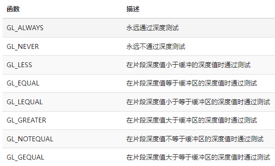

默认情况下使用的深度函数是GL_LESS，它将会丢弃深度值大于等于当前深度缓冲值的所有片段！


**深度值精度**

深度缓冲包含了一个介于0.0和1.0之间的深度值。下面这个（线性）方程将z值变换到了0.0到1.0之间的深度值：
$$
F_{depth} = \frac{z-near}{far-near}
$$
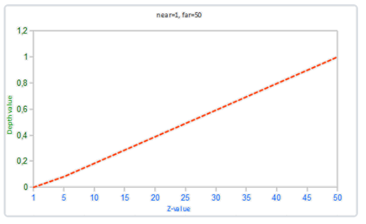


在实践中是几乎永远不会使用这样的线性深度缓冲！要想有正确的投影性质，需要使用一个非线性的深度方程，它是与 1/z 成正比的！


由于非线性方程与 1/z 成正比，在1.0和2.0之间的z值将会变换至1.0到0.5之间的深度值，这在z值很小的情况下提供了非常大的精度！

这样的一个考虑了远近距离的方程是这样的：
$$
F_{depth} = \frac{1/z-near}{far-near}
$$
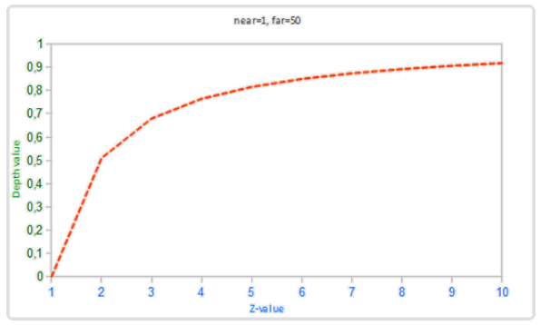


**深度冲突**

一个很常见的视觉错误会在两个平面或者三角形非常紧密地平行排列在一起时会发生，深度缓冲没有足够的精度来决定两个形状哪个在前面！

结果就是这两个形状不断地在切换前后顺序，这会导致很奇怪的花纹。这个现象叫做深度冲突(Z-fighting)

深度冲突不能够被完全避免，但一般会有一些技巧有助于在你的场景中减轻或者完全避免深度冲突


第一个也是最重要的技巧是**永远不要把多个物体摆得太靠近，以至于它们的一些三角形会重叠**

第二个技巧是**尽可能将近平面设置远一些**

另外一个很好的技巧是牺牲一些性能，**使用更高精度的深度缓冲**


**模板测试**

当片段着色器处理完一个片段之后，**模板测试**(Stencil Test)会开始执行，它也可能会丢弃片段！接下来，被保留的片段进入**深度测试**，它会丢弃更多的片段！

模板测试是根据又一个缓冲来进行的，它叫做**模板缓冲**！

一个模板缓冲中，（通常）每个模板值(Stencil Value)是8位的。所以每个像素/片段一共能有256种不同的模板值！


> 每个窗口库都需要为你配置一个模板缓冲。GLFW自动做了这件事，所以我们不需要告诉GLFW来创建一个，但其它的窗口库可能不会默认给你创建一个模板库，所以记得要查看库的文档。


举个例子：

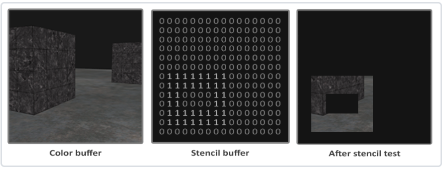


模板缓冲首先会被清除为0，之后在模板缓冲中使用1填充了一个空心矩形。场景中的片段将会只在片段的模板值为1的时候会被渲染（其它的都被丢弃了）。


模板缓冲操作允许我们在渲染片段时将模板缓冲设定为一个特定的值。通过在渲染时修改模板缓冲的内容，我们**写入**了模板缓冲。在同一个（或者接下来的）渲染迭代中，我们可以**读取**这些值，来决定丢弃还是保留某个片段。

但大体的步骤如下：

- 启用模板缓冲写入。
- 渲染物体，更新模板缓冲的内容。
- 禁用模板缓冲的写入。
- 渲染（其它）物体，这次根据模板缓冲的内容丢弃特定的片段。


`glEnable(GL_STENCIL_TEST);` 启用模板测试

`glClear(GL_COLOR_BUFFER_BIT | GL_DEPTH_BUFFER_BIT | GL_STENCIL_BUFFER_BIT);` 

`glStencilMask` 允许我们设置一个位掩码，它会与将要写入缓冲的模板值进行与(AND)运算！

默认情况下设置的位掩码所有位都为1，不影响输出！

```glsl
glStencilMask(0xFF); // 每一位写入模板缓冲时都保持原样
glStencilMask(0x00); // 每一位在写入模板缓冲时都会变成0（禁用写入）
```


**模板函数**

有两个函数用来配置模板测试：`glStencilFunc`和`glStencilOp`


**函数一：设置模板测试函数**

`glStencilFunc(GLenum func, GLint ref, GLuint mask)`

一共包含三个参数：

- `func` 设置模板测试函数，测试函数将会应用到已储存的模板值上和ref上；
- `ref` 设置了模板测试的参考值。模板缓冲的内容将会与这个值进行比较；
- `mask` 设置掩码，针对ref和储存的模板值在比较之前进行与运算；


上述例子中，模板测试函数设置如下：

`glStencilFunc(GL_EQUAL, 1, 0xFF)`

**含义：**只要片段的模板值等于1，通过模板测试，否则丢弃


**函数二：设置模板缓冲更新规则**

`glStencilOp(GLenum sfail, GLenum dpfail, GLenum dppass)`

一共包含三个参数：

- `sfail` 模板测试未通过时的行为
- `dpfail` 模板测试通过，但深度测试未通过时的行为
- `dppass` 模板测试和深度测试都通过时的行为


**行为表格如下：**

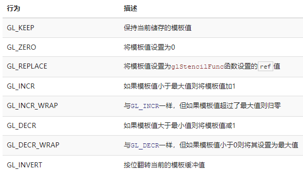


默认情况下`glStencilOp`是设置为`(GL_KEEP, GL_KEEP, GL_KEEP)`，所以不论任何测试的结果如何，模板缓冲保持不变！


**物体轮廓**

使用模板测试就可以完成的有用特性，它叫做物体轮廓！

如下图：

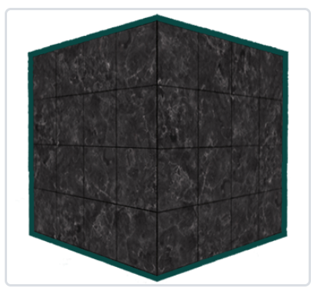


当你想要在策略游戏中选中一个单位进行操作的，想要告诉玩家选中的是哪个单位的时候，这个效果就非常有用了！

**创建轮廓的步骤如下：**

- 绘制（需要添加轮廓的）物体之前，将模板函数设置为GL_ALWAYS，每当物体的片段被渲染时，将模板缓冲更新为1
- 渲染物体
- 禁用模板写入以及深度测试
- 物体缩放一点点
- 使用一个不同的片段着色器，输出一个单独的（边框）颜色
- 再次绘制物体，但只在它们片段的模板值不等于1时才绘制
- 再次启用模板写入和深度测试


## 混合

OpenGL中，混合(Blending)通常是实现物体透明度(Transparency)的一种技术，它的颜色是物体本身的颜色和它背后其它物体的颜色的不同强度结合！

一个物体的透明度是通过它颜色的alpha值来决定，Alpha颜色值是颜色向量的第四个分量！


**丢弃片段**

有些图片并不需要半透明，只需要根据纹理颜色值，显示一部分，或者不显示一部分。

下面这个纹理正是这样的，它要么是完全不透明的（alpha值为1.0），要么是完全透明的（alpha值为0.0）：

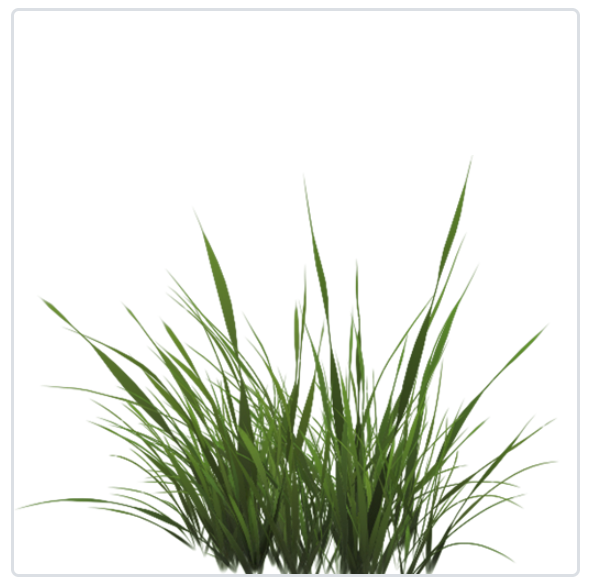


GLSL给了我们`discard`命令，一旦被调用，它就会保证片段不会被进一步处理！


> 当采样纹理的边缘的时候，OpenGL会对边缘的值和纹理下一个重复的值进行插值（因为我们将它的环绕方式设置为了GL_REPEAT。这通常是没问题的，但是由于我们使用了透明值，纹理图像的顶部将会与底部边缘的纯色值进行插值。这样的结果是一个半透明的有色边框，你可能会看见它环绕着你的纹理四边形。要想避免这个，每当你alpha纹理的时候，请将纹理的环绕方式设置为GL_CLAMP_TO_EDGE


**混合（Blend）**

`glEnable(GL_BLEND);`

启用了混合之后，我们需要告诉OpenGL它该**如何**混合：

OpenGL中的混合是通过下面这个方程来实现：
$$
C_{result} = C_{source}*F_{source} + C_{destination}*F_{destination}
$$


>  C是颜色，F是因子值！


举个例子：

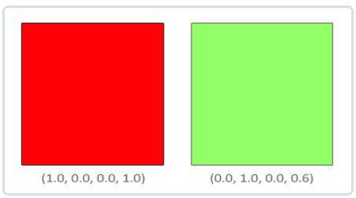


我们希望将这个半透明的绿色方形绘制在红色方形之上？那么因子值如何设置？

源因子值=> 绿色的alpha = 0.6

目标因子值=> 1-绿色的alpha = 0.4


所以我们得到最终的颜色：

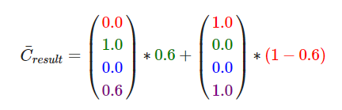


但我们该如何让OpenGL使用这样的因子呢？正好有一个专门的函数，叫做`glBlendFunc`

`glBlendFunc(GLenum sfactor, GLenum dfactor)` 接受两个参数，来设置源和目标因子！

选项如下：

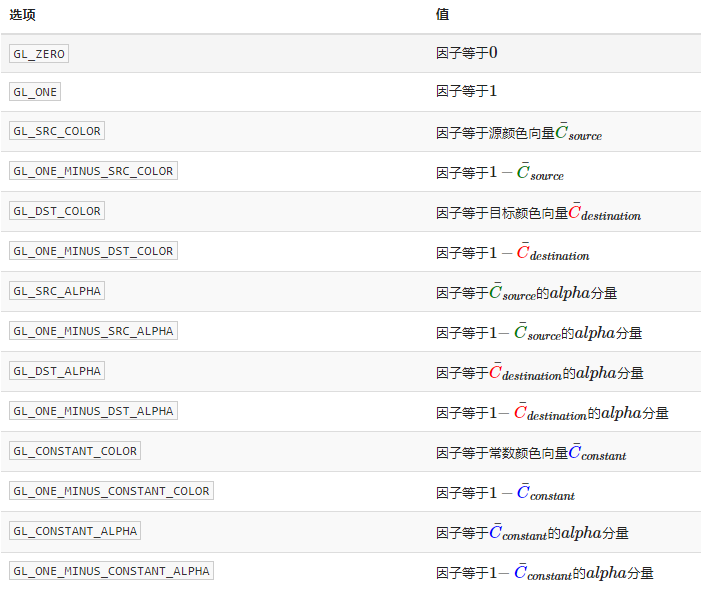

> 注意常数颜色向量C¯constant𝐶¯𝑐𝑜𝑛𝑠𝑡𝑎𝑛𝑡可以通过glBlendColor函数来另外设置。


所以上述的例子，设置如下：

`glBlendFunc(GL_SRC_ALPHA, GL_ONE_MINUS_SRC_ALPHA);`


## 面剔除

尝试在脑子中想象一个3D立方体，数数你从任意方向最多能同时看到几个面？

答：你应该能得出最大的面数是3，但你永远不能看到3个以上的面！


如果我们能够以某种方式丢弃这几个看不见的面，我们能省下超过50%的片段着色器执行数！


这是一个很好的主意，但我们仍有一个问题需要解决：**如何知道一个物体的某一个面不能从观察者视角看到呢？**


如果我们想象任何一个闭合形状，它的每一个面都有两侧，每一侧要么**面向**用户，要么背对用户！

如果我们能够只绘制**面向**观察者的面，这正是面剔除(Face Culling)所做！


**环绕顺序**

当我们定义一组三角形顶点时，会以特定的环绕顺序来定义它们，可能是顺时针(Clockwise)，也可能是逆时针(Counter-clockwise)！

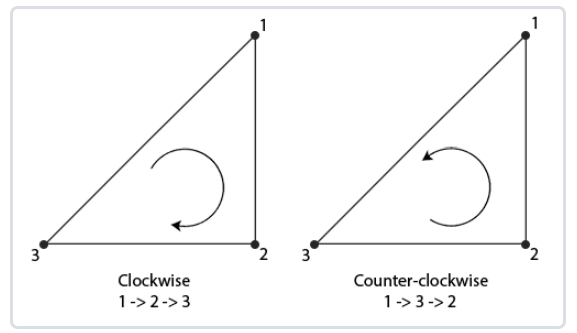

每个三角形由3个顶点所组成，我们会从三角形中间来看，为这3个顶点设定一个环绕顺序

可以看到，我们首先定义了顶点1，之后我们可以选择定义顶点2或者顶点3，这个选择将定义了这个三角形的环绕顺序

OpenGL在渲染图元的时候用这个信息决定一个三角形是正向三角形还是背向三角形。

默认情况下，逆时针顶点所定义的三角形将会被处理为正向三角形！


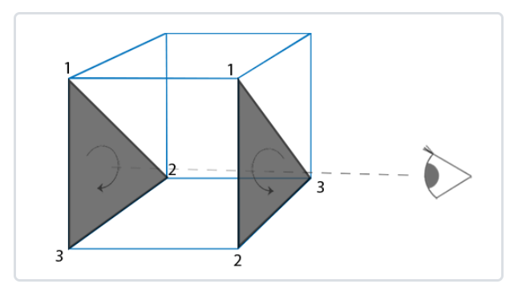


**面剔除相关API：**

- 使能 `glEnable(GL_CULL_FACE);`，默认初始值是禁用！
- 设置剔除面类型 ; `glCullFace(GL_FRONT);` 默认初始值是GL_BACK
- 定义正向面；`glFrontFace(GL_CCW);` 默认逆时针 (GL_CCW逆时针，GL_CW是顺时针)


## 帧缓冲

到目前为止，我们已经使用了很多屏幕缓冲：

- 写入颜色值的颜色缓冲
- 写入深度信息的深度缓冲
- 模板缓冲


这些缓冲结合起来叫做帧缓冲(Framebuffer)，它被储存在GPU内存中的某处！

**OpenGL允许我们定义我们自己的帧缓冲。**


目前所做的所有操作都是在默认帧缓冲的渲染缓冲上进行，默认的帧缓冲是在你创建窗口的时候生成和配置的（GLFW帮我们做了这些）！


**通过创建自己的帧缓冲，可获得额外的渲染目标！**


可能不能很快理解帧缓冲的应用，但渲染你的场景到不同的帧缓冲能够让我们在场景中加入类似镜子的东西，或者做出很酷的后期处理效果！


**创建一个帧缓冲**（帧缓冲对象(Framebuffer Object, FBO)）

```c++
unsigned int fbo;
glGenFramebuffers(1, &fbo);
```

**绑定帧缓冲**

`glBindFramebuffer(GL_FRAMEBUFFER, fbo);`

在绑定到GL_FRAMEBUFFER目标之后，所有的**读取**和**写入**帧缓冲的操作将会影响当前绑定的帧缓冲


现在还不能使用我们的帧缓冲，因为它还不完整,一个完整的帧缓冲需要满足以下的条件：

- 附加至少一个缓冲（颜色、深度或模板缓冲）。
- 至少有一个颜色附件(Attachment)。
- 所有的附件必须是完整的（保留了内存）。
- 每个缓冲都应该有相同的样本数(sample)。


**流程：**

1、创建一些附件

2、附件附加到帧缓冲

3、检查帧缓冲是否完整（`glCheckFramebufferStatus`，GL_FRAMEBUFFER_COMPLETE表示完整）

`if(glCheckFramebufferStatus(GL_FRAMEBUFFER) == GL_FRAMEBUFFER_COMPLETE)`


之后所有的渲染操作将会渲染到当前绑定帧缓冲的附件中，由于我们的帧缓冲不是默认帧缓冲，渲染指令将不会对窗口的视觉输出有任何影响！

出于这个原因，渲染到一个不同的帧缓冲被叫做**离屏渲染**(Off-screen Rendering)


> 如果要保证所有的渲染操作在主窗口中有视觉效果，我们需要再次激活默认帧缓冲，将它绑定到`0`
>
> glBindFramebuffer(GL_FRAMEBUFFER, 0);


在完成所有的帧缓冲操作之后，不要忘记删除这个帧缓冲对象：

> glDeleteFramebuffers(1, &fbo);


**附件**

一个内存位置，它能够作为帧缓冲的一个缓冲，可以将它想象为一个图像！

创建一个附件的时候我们有两个选项：

- 纹理
- 渲染缓冲对象(Renderbuffer Object)


**纹理附件**

当把纹理附加到帧缓冲，所有渲染指令会写入这个纹理；

优点：渲染操作的结果将会被储存在一个纹理图像中，之后可以在着色器中很方便地使用它！

**如何为帧缓冲创建一个纹理附件？**

```
unsigned int texture;
glGenTextures(1, &texture);
glBindTexture(GL_TEXTURE_2D, texture);

glTexImage2D(GL_TEXTURE_2D, 0, GL_RGB, 800, 600, 0, GL_RGB, GL_UNSIGNED_BYTE, NULL);

glTexParameteri(GL_TEXTURE_2D, GL_TEXTURE_MIN_FILTER, GL_LINEAR);
glTexParameteri(GL_TEXTURE_2D, GL_TEXTURE_MAG_FILTER, GL_LINEAR);
```

主要区别：data参数设为nullptr，也不需要Wrap方式和Mipmap


**附加到帧缓冲：**

`glFramebufferTexture2D(GL_FRAMEBUFFER, GL_COLOR_ATTACHMENT0, GL_TEXTURE_2D, texture, 0);`

参数如下：

- `target`：帧缓冲目标（绘制、读取或者两者皆有）
- `attachment`：附加的附件类型。当前我们正在附加一个颜色附件。注意最后的`0`意味着我们可以附加多个颜色附件。之后的教程中提到。
- `textarget`：希望附加的纹理类型
- `texture`：要附加的纹理本身
- `level`：多级渐远纹理的级别。将它保留为0。


**渲染缓冲对象附件**

和纹理图像一样，渲染缓冲对象是一个真正的缓冲，即一系列的字节、整数、像素等。

优点：会将数据储存为OpenGL原生的渲染格式，它是为离屏渲染到帧缓冲优化过的。

渲染缓冲对象直接将所有的渲染数据储存到它的缓冲中，不会做任何针对纹理格式的转换，让它变为一个更快的可写储存介质

渲染缓冲对象通常都是只写的，所以你不能读取它们！


因为它的数据已经是原生的格式了，当写入或者复制它的数据到其它缓冲中时是非常快，交换缓冲这样的操作在使用渲染缓冲对象时会非常快！


**创建一个渲染缓冲对象**

```
unsigned int rbo;
glGenRenderbuffers(1, &rbo);
```

**绑定渲染缓冲对象**

`glBindRenderbuffer(GL_RENDERBUFFER, rbo);`

**附加这个渲染缓冲对象**

`glFramebufferRenderbuffer(GL_FRAMEBUFFER, GL_DEPTH_STENCIL_ATTACHMENT, GL_RENDERBUFFER, rbo);`


渲染缓冲对象能为你的帧缓冲对象提供一些优化，**但知道什么时候使用渲染缓冲对象，什么时候使用纹理是很重要的？**

答：

（1）如果你不需要从一个缓冲中采样数据，那么对这个缓冲使用渲染缓冲对象会是明智的选择。

（2）如果你需要从缓冲中采样颜色或深度值等数据，那么你应该选择纹理附件。


# Day5


**那么帧缓冲究竟有什么用呢？**

因为能够以纹理图像方式访问已渲染场景的每个像素，所以我们可以在片段着色器中创建出非常有趣的效果，这些有趣效果统称为**后期处理效果**！


例如：反相、灰度化、模糊、锐化、卷积操作等等


## 立方体贴图

已经使用2D纹理很长时间。但除此之外仍有更多的纹理类型，立方体贴图(Cube Map)！

立方体贴图就是一个包含了6个2D纹理的纹理，每个2D纹理都组成了立方体的一个面！

立方体贴图有一个非常有用的特性，它可以通过一个**方向向量来进行索引/采样**！

假设我们有一个1x1x1的单位立方体，方向向量的原点位于它的中心。

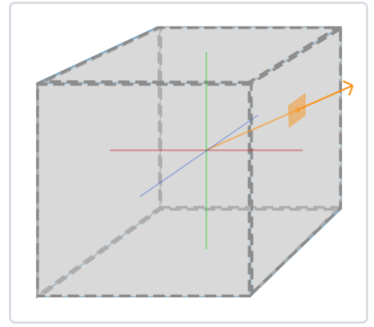


只要立方体的中心位于原点，我们就能使用立方体的实际位置向量来对立方体贴图进行采样！


**实操**

1、创建立方体贴图

```
unsigned int textureID;
glGenTextures(1, &textureID);
glBindTexture(GL_TEXTURE_CUBE_MAP, textureID);
```

2、设置参数

因为立方体贴图包含有6个纹理，每个面一个，我们需要调用glTexImage2D函数6次。

```
int width, height, nrChannels;
unsigned char *data;  
for(unsigned int i = 0; i < textures_faces.size(); i++)
{
    data = stbi_load(textures_faces[i].c_str(), &width, &height, &nrChannels, 0);
    glTexImage2D(
        GL_TEXTURE_CUBE_MAP_POSITIVE_X + i, 
        0, GL_RGB, width, height, 0, GL_RGB, GL_UNSIGNED_BYTE, data
    );
}
glTexParameteri(GL_TEXTURE_CUBE_MAP, GL_TEXTURE_MAG_FILTER, GL_LINEAR);
glTexParameteri(GL_TEXTURE_CUBE_MAP, GL_TEXTURE_MIN_FILTER, GL_LINEAR);
glTexParameteri(GL_TEXTURE_CUBE_MAP, GL_TEXTURE_WRAP_S, GL_CLAMP_TO_EDGE);
glTexParameteri(GL_TEXTURE_CUBE_MAP, GL_TEXTURE_WRAP_T, GL_CLAMP_TO_EDGE);
glTexParameteri(GL_TEXTURE_CUBE_MAP, GL_TEXTURE_WRAP_R, GL_CLAMP_TO_EDGE);
```

3、片段着色器应用

片段着色器中，使用了一个不同类型的采样器，`samplerCube`

```
in vec3 textureDir; // 代表3D纹理坐标的方向向量
uniform samplerCube cubemap; // 立方体贴图的纹理采样器

void main()
{             
    FragColor = texture(cubemap, textureDir);
}
```

使用立方体贴图的主要目的就是实现**天空盒**！


**天空盒**

天空盒是一个包含了整个场景的（大）立方体，它包含周围环境的6个图像，让玩家以为他处在一个比实际大得多的环境当中。

因为天空盒是作为背景出现的，所以它必须作为渲染的最底下，优先级最低的这种感觉！并且它**不受摄像机的位移向量影响**！

所以带天空盒的渲染方式：首先渲染天空盒，之后再渲染场景中的其它物体！

这样子能够工作，但不是非常高效，因为：我们就会对屏幕上的每一个像素运行一遍片段着色器，即便只有一小部分的天空盒最终是可见的！

可以使用**提前深度测试(Early Depth Testing)**轻松丢弃掉的片段能够节省我们很多宝贵的带宽！

所以，我们将会**最后渲染天空盒**，以获得轻微的性能提升！


**那提前深度测试究竟怎么做呢？**

透视除法在顶点着色器运行之后执行，如果我们将位置设置为xyww，通过顶点除法后，所有的z都为1.0f。代表最远的地方！

同时，我们需要修改深度测试函数，GL_LESS改为GL_LEQUAL！


**优化策略**

- 屏蔽View矩阵的位移向量影响
- 提前深度测试+最后渲染天空盒


**环境映射**

现在将整个环境映射到了一个纹理对象，能利用这个信息的不仅仅只有天空盒！

通过使用环境的立方体贴图，我们可以给物体**反射**和**折射**的属性。

这样使用环境立方体贴图的技术叫做**环境映射**(Environment Mapping)，其中最流行的两个是反射(Reflection)和折射(Refraction)。


**反射**

反射这个属性表现为物体（或物体的一部分）反射它周围环境，即根据观察者的视角，物体的颜色或多或少等于它的环境！

**镜子**就是一个反射性物体：它会根据观察者的视角反射它周围的环境。

如下图所示：

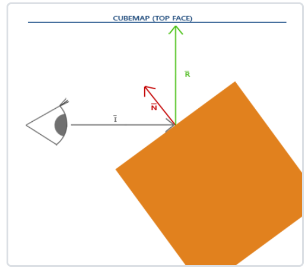


**折射**

环境映射的另一种形式是折射，折射是光线由于传播介质的改变而产生的方向变化。

在常见的类水表面上所产生的现象就是折射，光线不是直直地传播，而是弯曲了一点！

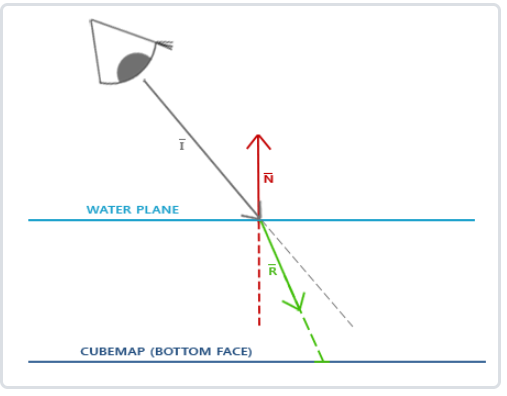

折射可以使用GLSL的内建refract函数来轻松实现，它需要一个法向量、一个观察方向和两个材质之间的折射率比(Refractive Index)。

一些最常见的折射率可以在下表中找到：

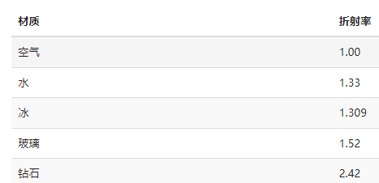


有了光照、反射、折射和顶点移动的正确组合，你可以创建出非常漂亮的水面！


> 动态环境贴图！


# Day7

**动态顶点数据填充**

之前所有的顶点数据，都是通过调用`glBufferData`一次性向显卡申请内存并拷贝数据过去。这就是静态填充方式

如果这部分数据频繁需要更新，或者只需要更新部分局部的数据，这样做就大大浪费了带宽！

**那么如何实现动态更新呢？**

（1）先调用`glBufferData`预分配显存

（2）

法1：调用`glBufferSubData`动态更新

法2：glMapBuffer + memcpy + glUnmapBuffer

例如：

```c++
loat data[] = {
  0.5f, 1.0f, -0.35f
  ...
};
glBindBuffer(GL_ARRAY_BUFFER, buffer);
// 获取指针
void *ptr = glMapBuffer(GL_ARRAY_BUFFER, GL_WRITE_ONLY);
// 复制数据到内存
memcpy(ptr, data, sizeof(data));
// 记得告诉OpenGL我们不再需要这个指针了
glUnmapBuffer(GL_ARRAY_BUFFER);
```


**了解Batch InterLeave布局和Batch SingleLeave布局**

将每一个顶点的位置、法线和/或纹理坐标紧密放置在一起，这就是交错布局（InterLeave），如：123123123这种方式。

但是其实，通常我们从文件加载顶点数据的时候：位置数据、法线数据、纹理坐标数据都是单独存储的。

这样其实用111122223333这样存储方式，就不需要多一个步骤，将他们整理正123123123的形式！

我们完全可以`glBufferSubData`接口，将这些1111、2222、3333按序拷贝至缓冲区！


> 注意：设置顶点属性，需要拷贝最后一个参数：offset偏移量！


**复制缓冲**

当缓冲区已经填充好数据之后，有可能会想与其他缓冲共享其中的数据，或者将部分数据复制到另一个缓冲的需求。

`glCopyBufferSubData`接口，让我们能够容易的从一个缓冲中复制数据到另一个缓冲中，函数原型如下：

`void glCopyBufferSubData(GLenum readtarget, GLenum writetarget, `

``GLintptr readoffset, GLintptr writeoffset, GLsizeiptr size);`

- readtarget 源缓冲目标
- writetarget 目标缓冲目标
- readoffset 源起始偏移量
- writeoffset 目标起始偏移量
- size 拷贝字节大小


如果源和目标的缓冲目标不一样，当然可以很容易的实现。但是如果两个缓冲类型都一样怎么办呢？

不能同时将两个缓冲绑定到同一个缓冲目标上。

OpenGL提供给我们另外两个缓冲目标，叫做`GL_COPY_READ_BUFFER`和`GL_COPY_WRITE_BUFFER`

所以就需要先绑定到这两个缓冲目标，然后再调用`glCopyBufferSubData`接口，进行拷贝，如下：

```
float vertexData[] = { ... };
glBindBuffer(GL_COPY_READ_BUFFER, vbo1);
glBindBuffer(GL_COPY_WRITE_BUFFER, vbo2);
glCopyBufferSubData(GL_COPY_READ_BUFFER, GL_COPY_WRITE_BUFFER, 0, 0, sizeof(vertexData));
```


## 高级GLSL

**GLSL内建变量**


**顶点着色器内建变量**

- gl_Position（输出）

    - 不用多说，顶点着色器的输出

- glPointSize（输出）

    - 图元GL_POINTS的点大小，设置点的像素宽高

- gl_VertexID（输入）

    - 正在绘制顶点的当前ID；
    - 当使用glDrawElements索引渲染，存储正在绘制顶点的当前索引；
    - 当使用glDrawArrays进行绘制的时候，储存从渲染调用开始的已处理顶点数量。

    


**片段着色器内建变量**

- gl_FragCoord（输入）
    - x和y分量是片段的窗口空间坐标
    - z分量等于对应片段的深度值
- gl_FrontFacing（输入）
    - 如果当前片段是正向面的一部分那么就是`true`，否则就是`false`
- gl_FragDepth（输出）
    - 设置片段的深度值


### 接口块

目前为止，从顶点着色器向片段着色器发送数据，都是定义n个in/out 同名变量实现。当程序更大时，可能发送的数据就很多，就希望发送类似结构体或数组的变量，GLSL给我们提供了叫做接口块的东西，有点类似struct！

如下：

顶点着色器

```glsl
#version 330 core
layout (location = 0) in vec3 aPos;
layout (location = 1) in vec2 aTexCoords;

uniform mat4 model;
uniform mat4 view;
uniform mat4 projection;

//=======================接口块
out VS_OUT
{
    vec2 TexCoords;
} vs_out;
//=======================接口块
void main()
{
    gl_Position = projection * view * model * vec4(aPos, 1.0);    
    vs_out.TexCoords = aTexCoords;
} 
```

片段着色器

```glsl
#version 330 core
out vec4 FragColor;
//=======================接口块
in VS_OUT
{
    vec2 TexCoords;
} fs_in;
//=======================接口块
uniform sampler2D texture;

void main()
{             
    FragColor = texture(texture, fs_in.TexCoords);   
}
```


必须满足接口块的名字相同即可，示例变量名不需要相同！


### Uniform缓冲对象

当我们使用多于1个的着色器时，我们发现多个着色器有一部分Uniform变量的设置是完全相同的，尤其是View和Project矩阵，但是我们还是需要针对不同的Shader进行重复的设置。

为了解决这个问题，OpenGL提供了Uniform缓冲对象，允许定义一系列在多个着色器程序中相同的全局Uniform变量，当使用Uniform缓冲对象的时候，我们只需要设置相关的uniform**一次**。


1、**Uniform缓冲对象**是一个缓冲，使用glGenBuffers创建，绑定到GL_UNIFORM_BUFFER缓冲目标，并将所有相关的uniform数据存入缓冲

2、**Uniform块布局**告诉OpenGL内存的哪一部分对应着着色器中的哪一个uniform变量

- 共享布局
- std140
- packed布局

3、**绑定点**，让OpenGL知道哪个Uniform缓冲对应哪个Uniform块

- glGetUniformBlockIndex 获取Uniform块索引
- glUniformBlockBinding 设置Uniform块的绑定点
- 创建GL_UNIFORM_BUFFER缓冲对象
- UNIFORM缓冲对象绑定到Uniform块


